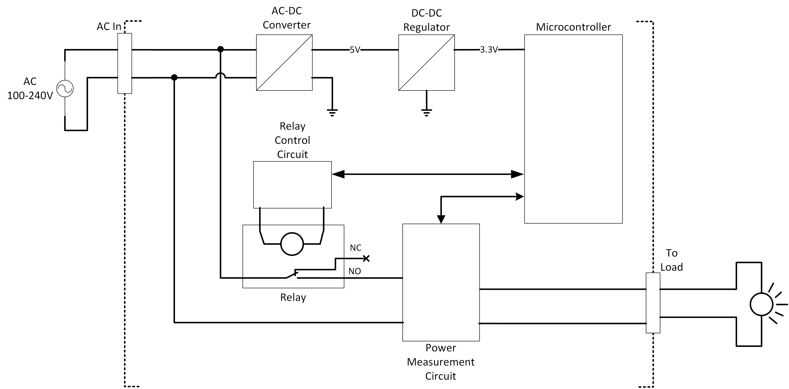

# IoTWallSwitch
An open-source IoT Wall Switch based on ESP device. I based this project on Xoseperez's [espurna-board project](https://github.com/xoseperez/espurna-board).

I aim this project to be a foundation of many small projects that ran on tap power supply.

## Block Diagram

## Primary Functionalities (User perspective):
1. Act as an on/off switch of an alternating or direct current load; the method of switching shall be done via physical access (e.g. button, capacitive touch) or via wirelessly (web interface, telnet, etc.)
2. Has the capability to measure the power consumed by the load, and to report it to an external entity (cloud, local household server).
3. Support more than one wireless protocol for redundancy
4. Has the capability to update functionality after deployment without physical access (over-the-air or OTA updates).

## Tech Stack
- Schematic and Layout: KiCAD
- Toolchain: TBA, currently thinking of building over ESP-IDF
- Unit Testing: CppUTest

## Applications:
- Generic Smart Switch for any load below 10A
- Household and industrial lighting
- Small motors/fans/pumps
- Desktop/Laptop Charger
- Television
- Speakers

## 3D Preview

